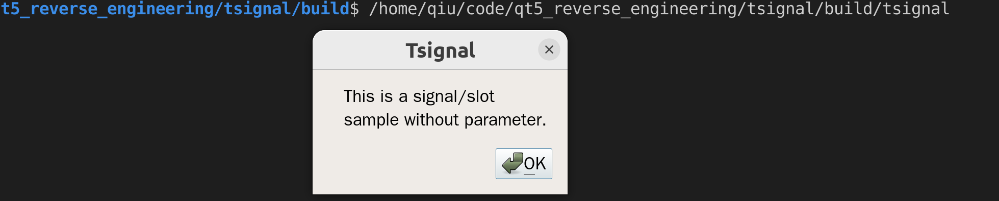

# Qt5 Reverse enginneering report

| Author               | Time       |
| -------------------- | ---------- |
| github.com/KaitaoQiu | 2023/10/06 |

[toc]

## Build a test cpp application

source code file structure:

```bash
.
├── main.cpp
├── tsginal.cpp
└── tsignal.h
```

After building this application ,we could find a window that shows



## info on moc_cpp

And from the above code, it can be seen that QT defines keywords such as SIGNALS, Slots, EMIT and other keywords to simplify the development of QT programs. And QT uses the meta object compiler MOC (Meta Object Compiler) to translate these keywords into normal C ++ code for GCC or VC compilation. For example, the QT keywords in tsignal.cpp will be compiled as follows:


from moc_tsignal.cpp, we can find that

```cpp
/****************************************************************************
** Meta object code from reading C++ file 'tsignal.h'
**
** Created by: The Qt Meta Object Compiler version 67 (Qt 5.9.7)
**
** WARNING! All changes made in this file will be lost!
*****************************************************************************/

#include "../../../tsignal/tsignal.h"
#include <QtCore/qbytearray.h>
#include <QtCore/qmetatype.h>
#if !defined(Q_MOC_OUTPUT_REVISION)
#error "The header file 'tsignal.h' doesn't include <QObject>."
#elif Q_MOC_OUTPUT_REVISION != 67
#error "This file was generated using the moc from 5.9.7. It"
#error "cannot be used with the include files from this version of Qt."
#error "(The moc has changed too much.)"
#endif

QT_BEGIN_MOC_NAMESPACE
QT_WARNING_PUSH
QT_WARNING_DISABLE_DEPRECATED
struct qt_meta_stringdata_TsignalApp_t {
    QByteArrayData data[8];
    char stringdata0[58];
};
#define QT_MOC_LITERAL(idx, ofs, len) \
    Q_STATIC_BYTE_ARRAY_DATA_HEADER_INITIALIZER_WITH_OFFSET(len, \
    qptrdiff(offsetof(qt_meta_stringdata_TsignalApp_t, stringdata0) + ofs \
        - idx * sizeof(QByteArrayData)) \
    )
static const qt_meta_stringdata_TsignalApp_t qt_meta_stringdata_TsignalApp = {
    {
QT_MOC_LITERAL(0, 0, 10), // "TsignalApp"
QT_MOC_LITERAL(1, 11, 8), // "mySignal"
QT_MOC_LITERAL(2, 20, 0), // ""
QT_MOC_LITERAL(3, 21, 1), // "x"
QT_MOC_LITERAL(4, 23, 13), // "mySignalParam"
QT_MOC_LITERAL(5, 37, 1), // "y"
QT_MOC_LITERAL(6, 39, 6), // "mySlot"
QT_MOC_LITERAL(7, 46, 11) // "mySlotParam"

    },
    "TsignalApp\0mySignal\0\0x\0mySignalParam\0"
    "y\0mySlot\0mySlotParam"
};
#undef QT_MOC_LITERAL

static const uint qt_meta_data_TsignalApp[] = {

 // content:
       7,       // revision
       0,       // classname
       0,    0, // classinfo
       6,   14, // methods
       0,    0, // properties
       0,    0, // enums/sets
       0,    0, // constructors
       0,       // flags
       3,       // signalCount

 // signals: name, argc, parameters, tag, flags
       1,    0,   44,    2, 0x06 /* Public */,
       1,    1,   45,    2, 0x06 /* Public */,
       4,    2,   48,    2, 0x06 /* Public */,

 // slots: name, argc, parameters, tag, flags
       6,    0,   53,    2, 0x0a /* Public */,
       6,    1,   54,    2, 0x0a /* Public */,
       7,    2,   57,    2, 0x0a /* Public */,

 // signals: parameters
    QMetaType::Void,
    QMetaType::Void, QMetaType::Int,    3,
    QMetaType::Void, QMetaType::Int, QMetaType::Int,    3,    5,

 // slots: parameters
    QMetaType::Void,
    QMetaType::Void, QMetaType::Int,    3,
    QMetaType::Void, QMetaType::Int, QMetaType::Int,    3,    5,

       0        // eod
};

void TsignalApp::qt_static_metacall(QObject *_o, QMetaObject::Call _c, int _id, void **_a)
{
    if (_c == QMetaObject::InvokeMetaMethod) {
        TsignalApp *_t = static_cast<TsignalApp *>(_o);
        Q_UNUSED(_t)
        switch (_id) {
        case 0: _t->mySignal(); break;
        case 1: _t->mySignal((*reinterpret_cast< int(*)>(_a[1]))); break;
        case 2: _t->mySignalParam((*reinterpret_cast< int(*)>(_a[1])),(*reinterpret_cast< int(*)>(_a[2]))); break;
        case 3: _t->mySlot(); break;
        case 4: _t->mySlot((*reinterpret_cast< int(*)>(_a[1]))); break;
        case 5: _t->mySlotParam((*reinterpret_cast< int(*)>(_a[1])),(*reinterpret_cast< int(*)>(_a[2]))); break;
        default: ;
        }
    } else if (_c == QMetaObject::IndexOfMethod) {
        int *result = reinterpret_cast<int *>(_a[0]);
        {
            typedef void (TsignalApp::*_t)();
            if (*reinterpret_cast<_t *>(_a[1]) == static_cast<_t>(&TsignalApp::mySignal)) {
                *result = 0;
                return;
            }
        }
        {
            typedef void (TsignalApp::*_t)(int );
            if (*reinterpret_cast<_t *>(_a[1]) == static_cast<_t>(&TsignalApp::mySignal)) {
                *result = 1;
                return;
            }
        }
        {
            typedef void (TsignalApp::*_t)(int , int );
            if (*reinterpret_cast<_t *>(_a[1]) == static_cast<_t>(&TsignalApp::mySignalParam)) {
                *result = 2;
                return;
            }
        }
    }
}

const QMetaObject TsignalApp::staticMetaObject = {
    { &QMainWindow::staticMetaObject, qt_meta_stringdata_TsignalApp.data,
      qt_meta_data_TsignalApp,  qt_static_metacall, nullptr, nullptr}
};


const QMetaObject *TsignalApp::metaObject() const
{
    return QObject::d_ptr->metaObject ? QObject::d_ptr->dynamicMetaObject() : &staticMetaObject;
}

void *TsignalApp::qt_metacast(const char *_clname)
{
    if (!_clname) return nullptr;
    if (!strcmp(_clname, qt_meta_stringdata_TsignalApp.stringdata0))
        return static_cast<void*>(this);
    return QMainWindow::qt_metacast(_clname);
}

int TsignalApp::qt_metacall(QMetaObject::Call _c, int _id, void **_a)
{
    _id = QMainWindow::qt_metacall(_c, _id, _a);
    if (_id < 0)
        return _id;
    if (_c == QMetaObject::InvokeMetaMethod) {
        if (_id < 6)
            qt_static_metacall(this, _c, _id, _a);
        _id -= 6;
    } else if (_c == QMetaObject::RegisterMethodArgumentMetaType) {
        if (_id < 6)
            *reinterpret_cast<int*>(_a[0]) = -1;
        _id -= 6;
    }
    return _id;
}

// SIGNAL 0
void TsignalApp::mySignal()
{
    QMetaObject::activate(this, &staticMetaObject, 0, nullptr);
}

// SIGNAL 1
void TsignalApp::mySignal(int _t1)
{
    void *_a[] = { nullptr, const_cast<void*>(reinterpret_cast<const void*>(&_t1)) };
    QMetaObject::activate(this, &staticMetaObject, 1, _a);
}

// SIGNAL 2
void TsignalApp::mySignalParam(int _t1, int _t2)
{
    void *_a[] = { nullptr, const_cast<void*>(reinterpret_cast<const void*>(&_t1)), const_cast<void*>(reinterpret_cast<const void*>(&_t2)) };
    QMetaObject::activate(this, &staticMetaObject, 2, _a);
}
QT_WARNING_POP
QT_END_MOC_NAMESPACE

```

## function

From the above source code, we can see that `mySignal` is translated into the following code, and if `mySignal` with parameters, then there will be one more type of type conversion process:

```cpp
// SIGNAL 0
void TsignalApp::mySignal()
{
    QMetaObject::activate(this, &staticMetaObject, 0, nullptr);
}

// SIGNAL 1
void TsignalApp::mySignal(int _t1)
{
    void *_a[] = { nullptr, const_cast<void*>(reinterpret_cast<const void*>(&_t1)) };
    QMetaObject::activate(this, &staticMetaObject, 1, _a);
}

// SIGNAL 2
void TsignalApp::mySignalParam(int _t1, int _t2)
{
    void *_a[] = { nullptr, const_cast<void*>(reinterpret_cast<const void*>(&_t1)), const_cast<void*>(reinterpret_cast<const void*>(&_t2)) };
    QMetaObject::activate(this, &staticMetaObject, 2, _a);
}
```

Whether there is parameter or not, `QMetaObject::activate` function is called.

## QT meta data

`QMetaObject::activate` makes QT dynamically call the signal associated slot, but this also brings us difficulty in cracking the QT program.

Suppose there is such a program to check after receiving the registration code call. If it is correct, trigger a signal of successful registration, otherwise the signal of the registration failure will be triggered.The direct idea of the registration code crack is to find the registration function through the information that fails to register, but from the above, we can know that when sending the signal, the signal is triggered by QMetaObject :: Activate, which is not a direct function call.Even if we break up and down the error information, at this time, there is a large amount of QT core library calling information on the stack, and the function of the trigger signal is very troublesome.

Qt is associated with the groove through Connect.But when Connet, we cannot directly know the position of the slot function associated with the signal.For example:

```
connect(this,SIGNAL(mySignal()),SLOT(mySlot()));
```

we can use IDA to decompile and get:


There is no address of myslot, and only myslot names are retained.

However, QT can correctly call the corresponding function because QT will save the metadata of the signal and slot, and dynamically find the corresponding method when running.

There is the metadata:

```cpp
static const qt_meta_stringdata_TsignalApp_t qt_meta_stringdata_TsignalApp = {
    {
QT_MOC_LITERAL(0, 0, 10), // "TsignalApp"
QT_MOC_LITERAL(1, 11, 8), // "mySignal"
QT_MOC_LITERAL(2, 20, 0), // ""
QT_MOC_LITERAL(3, 21, 1), // "x"
QT_MOC_LITERAL(4, 23, 13), // "mySignalParam"
QT_MOC_LITERAL(5, 37, 1), // "y"
QT_MOC_LITERAL(6, 39, 6), // "mySlot"
QT_MOC_LITERAL(7, 46, 11) // "mySlotParam"

    },
    "TsignalApp\0mySignal\0\0x\0mySignalParam\0"
    "y\0mySlot\0mySlotParam"
};
#undef QT_MOC_LITERAL

static const uint qt_meta_data_TsignalApp[] = {

 // content:
       7,       // revision
       0,       // classname
       0,    0, // classinfo
       6,   14, // methods
       0,    0, // properties
       0,    0, // enums/sets
       0,    0, // constructors
       0,       // flags
       3,       // signalCount

 // signals: name, argc, parameters, tag, flags
       1,    0,   44,    2, 0x06 /* Public */,
       1,    1,   45,    2, 0x06 /* Public */,
       4,    2,   48,    2, 0x06 /* Public */,

 // slots: name, argc, parameters, tag, flags
       6,    0,   53,    2, 0x0a /* Public */,
       6,    1,   54,    2, 0x0a /* Public */,
       7,    2,   57,    2, 0x0a /* Public */,

 // signals: parameters
    QMetaType::Void,
    QMetaType::Void, QMetaType::Int,    3,
    QMetaType::Void, QMetaType::Int, QMetaType::Int,    3,    5,

 // slots: parameters
    QMetaType::Void,
    QMetaType::Void, QMetaType::Int,    3,
    QMetaType::Void, QMetaType::Int, QMetaType::Int,    3,    5,

       0        // eod
};
```

In addition, each QT object has a `qt_static_metacall` method to determine the call function:

```cpp
void TsignalApp::qt_static_metacall(QObject *_o, QMetaObject::Call _c, int _id, void **_a)
{
    if (_c == QMetaObject::InvokeMetaMethod) {
        TsignalApp *_t = static_cast<TsignalApp *>(_o);
        Q_UNUSED(_t)
        switch (_id) {
        case 0: _t->mySignal(); break;
        case 1: _t->mySignal((*reinterpret_cast< int(*)>(_a[1]))); break;
		// ...
        default: ;
        }
    } else if (_c == QMetaObject::IndexOfMethod) {
		//...
}

```

**in this function `void TsignalApp::qt_static_metacall(QObject *_o, QMetaObject::Call _c, int _id, void **_a)`,  there is a input parameter called `int _id`, which is the index of the corresponding QT method (signal/slot, etc.).**

```cpp
#define QT_MOC_LITERAL(idx, ofs, len) \
    Q_STATIC_BYTE_ARRAY_DATA_HEADER_INITIALIZER_WITH_OFFSET(len, \
    qptrdiff(offsetof(qt_meta_stringdata_TsignalApp_t, stringdata0) + ofs \
        - idx * sizeof(QByteArrayData)) \
    )
```

In fact, qt_meta_ and QT_META_DATA_TSIGNALALAPP in the QT program after compilation will be encapsulated in another data structure. This structure is analyzed by the source code of Qt.

`QMetaObject`:


And another important thing `QMetaObjectPrivate`:


In fact, this is the corresponding content in `moc_tsignal.cpp`


And we can get the name of method after micro method


which is

```cpp
    "TsignalApp\0mySignal\0\0x\0mySignalParam\0"
    "y\0mySlot\0mySlotParam"
```
